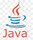

<h3>Привет! Я Пушкин Никита</h3>
 Я работаю аналитиком криптографических средств.
  А также учусь в МГТУ им.Баумана на кафедре информационной безопасности. 🏫👨‍🎓
  На гитхаб публикую пет-проектики, которые пилю в свободное время, а также институтские лабораторные
  Так что моя активность ограниченна временем, а также NDA и то,что тут не считаются коммиты в закрытых репозиториях
😁
 

 

<h3> Технический стэк </h3>
<h3> Языки программирования</h3>

 

Тут как у всех - Python. Решает все мои хотелки:
  1) API-шки : погоды, курсов валют, habr, google-sheets
  2) Desktop-ные : Qt с Qt-Designer самый лучший
вариант как по полноте функционала,так и по скорости разработки из-за конструктора,
  Но также был опыт и в более легковесных: kivy,pygame, pySimpleGui
  3) Фреймворк: Django

Большой процент C++ из-за вузовских лабораторных, но имею в-целом позитивное отношение.
  Ну и куда без верстки, по-немногу всего CSS,HTML,JS (да, я знаю, что язык разметки != АЯПу)
  Также очень хочется написать, что-то на swift для dynamic island, ну и, конечно же golang
  Аналитика подразумевает огромное количество ревью кода, так я познакомился с Java и .Net Core (да, я знаю, что это не язык)

  Пишу в Pycharm, Clion, Webstorm и VisualStudioCode.

И использую пару расширений: Statistic (считает кол-во строк),
Sonarlint (урезанная от Sonarqube утилита по предупреждения утечек, code style и другие)
 

<h3>Контроль версий и task tracker:</h3>
Работа с большими проектами и с большим числом разработчиков заставляет соответсвовать стандартам разработки.
Далее приведен мой ежедневный стэк технологий:

1) Для кода: Gitlab , Github для гита. Gitflow является любимой методологией работы с Git.
2) SVN для текстовых файлов
3) Jira для отслеживания задач, куда без контроля прогресса задач.

<h3>Виртуализация и контейнеризация:</h3>
Работал как с VirtualBox, так и VMware Workstation. Предпочитаю больше второй вариант
Потихоньку набираюсь опыта в VMware vSphere

 
Имею небольшой опыт работы с docker для развертывания приложений. Безумно хочется найти время для него
для более глубого изучения, в том числе в паре с Kubernetes.

<h3> Программы для работы </h3>
Для формирования стэков вызовов пользуюсь Understand for C++. Для hex представлений и 
изменений работаю в Hex Editor Neo, такая необходимость вызвана, например, изменением содержания 
сертификатов во время тестов на корректность отображения нарушений контроля целостности. 
 Также рекомендую Araxis Merge.
 Закончу тем, что остальное ПО для работы перечисленно в других пунктах.

<h3>Cервера:</h3>
В рамках работ с TLS (в том числе TLS 1.3) и операционками удалось поработать с внушительным списком
1) Nginx, Apache, Apache Tomcat, Libercat (российская разработка от вендора JDK Liberica)
2) SSH

<h3> Базы данных </h3>
Все, как у людей. Начал изучение с SQLite, после перешел на MySQL,
а остановился на Postgres

<h3> Операционные системы </h3>
 Основными системами являются, конечно, Windows и Ubuntu. Для возможности написания скриптов для тестирования,
а так же взаимодействия с git и со множеством всякого другого ПО мною также были изучены темы командных строк (bash)

Кроме этого имею опыт работы с Kali и Astra,MacOS. Все из них имеют свои плюсы и хорошо справляются с возложенными на них
задачами.
Так, например, на Kali я работал с metasploit-ом и другими встроенными пентестерскими утилитами.
А Астра единственная имеет функцию замкнутой программной среды.
Это позволяет лучше следить за контролем замкнутости каких-либо продуктов для исключения возникновений криптографически
опасных ситуаций.
 

 

